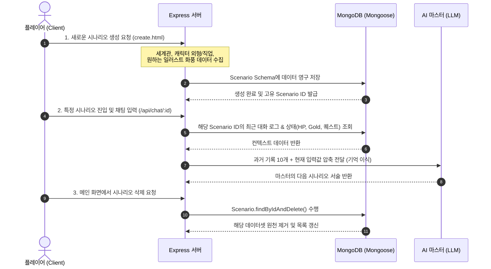
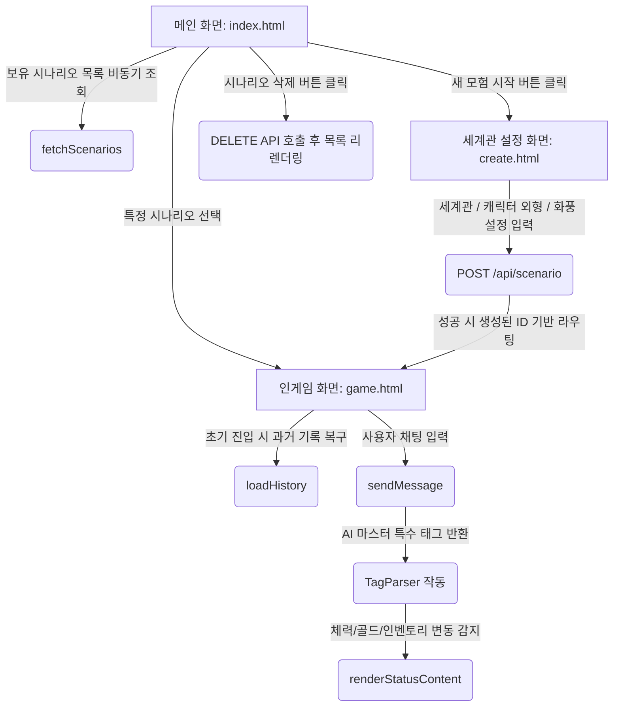
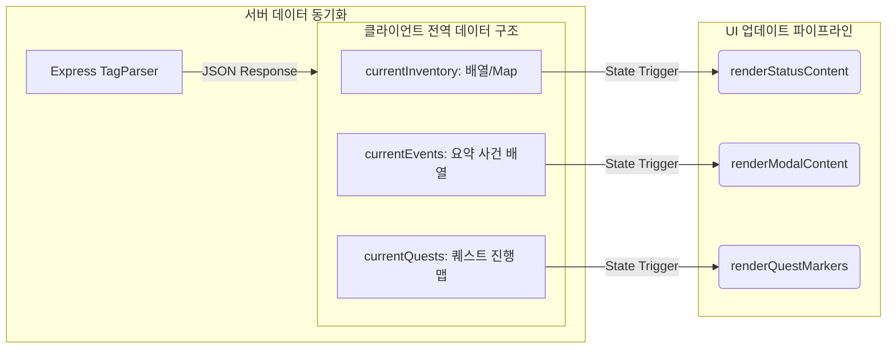
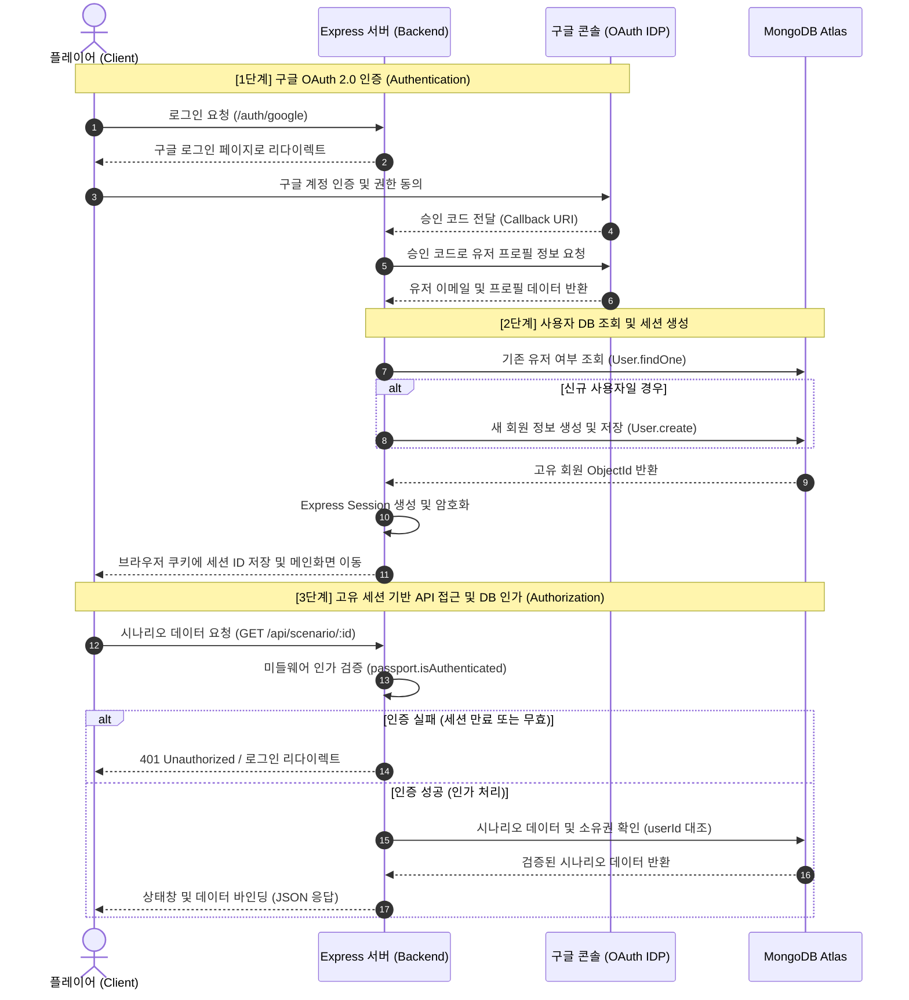
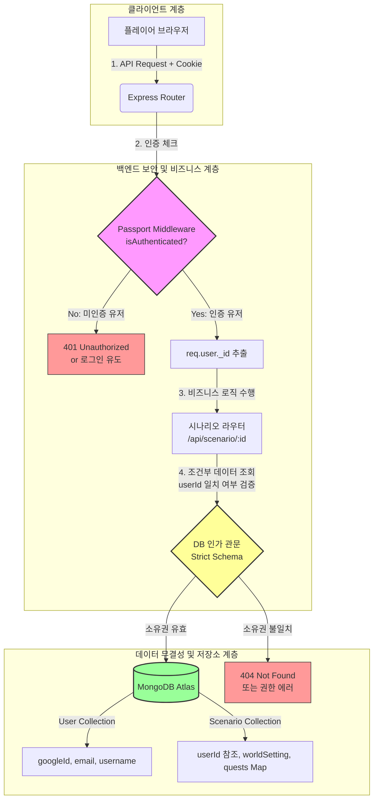

# AI 마스터가 진행해주는 웹 기반 TRPG 

## 실행 - https://trpg-3yyp.onrender.com/

> **"DB 데이터 - 프롬프트 피드백 순환 구조(NER 기법)"** 기반의 웹 기반 TRPG 게임 엔진입니다. 유저의 선택과 AI 마스터의 상호작용을 실시간으로 정밀하게 제어하며, 몰입감 넘치는 텍스트 어드벤처 환경을 제공합니다.

---

## 📜 시나리오 및 세션 관리 시스템 (Scenario & Session Management)

본 프로젝트는 단발성 채팅을 넘어, 플레이어만의 고유한 모험 세계관을 생성하고 영구적으로 보존 및 관리할 수 있는 **멀티 세션 시나리오 파이프라인**을 구축했습니다. 모든 데이터는 유저 고유 ID와 매칭되어 독립된 모험 레이어로 관리됩니다.

### 🗺️ 핵심 관리 프로세스 및 데이터 흐름

## 🛠️ 주요 기능 기술 스펙 (Technical Specification)

### 프론트엔드 

## 💻 프론트엔드 아키텍처 (Frontend Architecture)

본 프로젝트의 클라이언트 단은 플레이어의 높은 몰입감을 위해 **다크 판타지 TRPG UI 테마**를 일관되게 유지하며, 비비동기(Async/Await) 통신을 기반으로 한 동적 UI 렌더링 및 실시간 상태 동기화 구조로 설계되었습니다.

### 🔄 1. 화면 전환 및 데이터 흐름 (Screen Flow)

사용자의 진입부터 게임 플레이, 세션 관리까지의 프론트엔드 내비게이션 및 API 연동 흐름은 다음과 같습니다.

### 컴포넌트 및 UI 구조 (UI Components)
화면 가독성을 극대화하고 CRPG 특유의 인터페이스를 구현하기 위해 화면 레이아웃을 3가지 핵심 핵심 구역과 모달 컴포넌트로 분리하여 고정(position: absolute/fixed) 배치했습니다.

### 메인 대시보드 (index.html)

시나리오 카드 덱: 유저가 생성한 모험들의 정보(세계관, 타이틀)를 REST API로 긁어와 동적으로 카드 UI 형태로 렌더링합니다.

제어 액션 컴포넌트: 각 시나리오 카드 내부에 인게임 진입 버튼과, 세션 데이터 원격 소거를 위한 [삭제] 버튼을 유기적으로 배치했습니다.

### 인게임 화면 (game.html)

메인 뷰 포트: AI 마스터가 서술하는 다크 판타지 배경 및 DALL-E 기반 삽화 이미지가 출력되는 중앙 스크린 영역입니다.

사이드 윙 상태창 (#status-window): 화면 좌측 레이어에 반투명 양피지 테마로 고정되어, 실시간 데이터(HP 바, Gold 등)를 직관적으로 상시 노출합니다.

하단 액션 대화창 (#chat-section): 플레이어의 행동 입력 양식(Input)과 AI 메시지 말풍선이 flex-direction: column 구조로 차곡차곡 스택되는 영속적 로그 컴포넌트입니다.

모달 시스템 (#inventory-list-modal 등): 화면을 무겁게 차지하던 지저분한 사이드바를 제거하고, 확장형 인벤토리 및 AI가 동적으로 갱신한 몬스터 도감(bestiary)을 팝업 형태로 호출하여 깔끔한 화면 해상도를 확보했습니다.

### 💾 3. 클라이언트 상태 관리 (Client State Management)
데이터 분류와 저장을 통한 ai 영속성 유지

데이터 영속성 및 동적 렌더링 다이어그램

### 핵심 상태 데이터 사양
가변 데이터 전역 관리: currentInventory, currentEvents, currentQuests 변수를 전역 공간에 확보하여 AI 마스터와의 인터랙션 결과셋을 실시간 저장하는 1차 버퍼 역할을 수행합니다.

새로고침 컨텍스트 유지: 브라우저 종료 및 새로고침(F5) 시 데이터가 휘발되는 문제를 차단하기 위해, 초기 구동 시 URL 경로에서 식별자 ID(window.location.pathname.split('/'))를 파싱하여 백엔드로부터 상태값과 과거 대화 데이터셋({ role, content })을 역추적해 다시 빌딩하는 영속성 파이프라인을 구축했습니다.

데이터 바인딩 및 동기화 (renderStatusContent): 비동기 fetch 요청 완료 시 단순히 데이터만 변경하는 것이 아니라, UI 변경 이벤트 핸들러가 가동되어 체력 게이지 바(width %), 골드 지표텍스트, 퀘스트 수량이 동기화되어 화면에 즉각 리렌더링되도록 구현했습니다.

## 🛡️ 백엔드 API & DB 인증/인가 시스템 (Authentication & Authorization)
본 프로젝트는 안전한 사용자 데이터 관리와 시나리오 보호를 위해 구글 OAuth 2.0 기반의 인증과 Express-Session 메커니즘을 결합한 다중 보안 인가 체계를 구축했습니다. 타인의 시나리오 데이터나 모험 기록(데이터 무결성)을 완벽히 격리·보호하는 것을 핵심 목표로 합니다.

### 컴포넌트 간 데이터 보호 및 인가 구조 (Architecture Diagram)
클라이언트의 요청이 어떤 보안 관문(인증 미들웨어, DB 소유권 검증)을 거쳐 데이터베이스에 도달하는지 보여주는 구조도입니다.

1. 고유 세션 기반 시나리오 생성 (create.html & server.js)
세계관 및 캐릭터 맞춤형 빌딩: 단순히 게임을 시작하는 것이 아니라, 시나리오 생성 단계에서 플레이어가 직접 세계관 배경(worldSetting), 캐릭터 정보(characterInfo), 캐릭터 외형(appearance) 및 일러스트 화풍(artStyle: 실사, 애니메이션, 판타지 유화 등)을 커스텀 설정할 수 있습니다.

    Mongoose ODM 스키마 구조: userId 참조 필드를 통해 회원별로 다중 시나리오를 보유할 수 있도록 구조화했으며, 독립된 Object ID 기반 라우팅 경로(window.location.pathname.split('/'))를 통해 고유한 모험 방을 식별합니다.

2. AI 마스터 기억 이식 및 컨텍스트 동기화
상태창 및 가변 데이터 실시간 바인딩: 라우터가 작동할 때 DB에서 현재 시나리오의 실시간 상태값(HP, Gold, 스킬 트리, 병렬 퀘스트 맵)을 긁어모아 시스템 프롬프트에 동적으로 결합합니다.

3. 컨텍스트 유실 방지: 페이지를 새로고침하거나 브라우저를 완전히 나갔다 들어와도 loadHistory()를 통해 DB에 쌓인 과거 메시지 데이터셋({ role: "user/assistant", content: "..." })을 역추적하여 AI의 메모리에 실시간 주입하므로 흐름이 끊기지 않는 영속적인 모험을 보장합니다.

4. 메인 화면 시나리오 관리 및 삭제 메커니즘 (index.html)
유동적 목록 렌더링 (fetchScenarios): 메인 대시보드 진입 시 유저가 보유한 모든 모험 기록 리스트를 REST API를 통해 비동기 호출하고, UI에 동적으로 렌더링합니다.

5. 원격 데이터 소거: 축적된 테스트 데이터나 실패한 모험 기록을 깔끔하게 정리할 수 있도록 각 리스트 카드 옆에 강력한 [삭제] 컴포넌트를 배치했습니다. 클라이언트에서 삭제 요청 시 서버는 엔드포인트(DELETE /api/scenario/:id)를 통해 몽고DB 컬렉션 내의 데이터를 안전하게 원천 소거(Purge)합니다.

## 🗄️ 시나리오 데이터베이스 스키마 구조 (Scenario Schema)

    const ScenarioSchema = new mongoose.Schema({
        userId: { type: mongoose.Schema.Types.ObjectId, ref: 'User' }, // 소유 유저 연동
        title: String,          // 모험의 제목
        worldSetting: String,   // 딥 다크 판타지 등 배경 세계관 사양
        characterInfo: String,  // 캐릭터 이름, 직업 및 기본 스펙
        appearance: String,     // [추가] AI 삽화 생성을 위한 외형 묘사 데이터
        artStyle: String,       // [추가] 생성형 화풍 스타일 (유화/애니/사진 등)
        questLines: [String],   // 5턴 주기로 자동 압축 요약되는 핵심 연대기 로그
        quests: {               // 병렬 진행 가능한 서브/메인 퀘스트 마커 관리 맵
            type: Map,
            of: String          // e.g., {"드래곤 토벌": "진행중", "고블린 처치": "✅완료"}
        },
        bestiary: {             // AI가 실시간 동적 생성한 몬스터 도감 박제 구조
            type: Map,
            of: mongoose.Schema.Types.Mixed // hp, attack, defense, loot 스펙 스택
        },
        createdAt: { type: Date, default: Date.now }
    });

## 🛠 Tech Stack & Technical Decisions (사용 기술 및 채택 이유)

| 분류 | 기술 스택 | 핵심 채택 이유 및 최적화 전략 |
| :--- | :--- | :--- |
| **Front-end** | HTML5, CSS3, JavaScript | 외부 무거운 프레임워크를 배제한 **Vanilla (ES6+) 환경**을 구성하여 경량화된 웹 UI를 구현했습니다. 실시간 캐릭터 상태 UI 변동 및 다크 판타지 컨셉의 3단 패널 레이아웃을 정밀 제어합니다. |
| **Back-end** | Node.js, Express | AI API가 출력하는 대량의 텍스트 스트림을 실시간 가로채고(Intercept) 비동기로 파싱해야 하는 아키텍처 특성상, **이벤트 기반 비동기 처리**에 강력한 Express 환경을 구축했습니다. |
| **Database** | MongoDB | 유저별로 소지 아이템 가방 데이터가 수시로 늘어나고, AI 마스터가 생성하는 난수형 몬스터 스펙(도감)이 비정형으로 변하는 TRPG 게임 데이터 특성에 가장 유연하게 대응하는 **NoSQL 구조**를 채택했습니다. |
| **ORM** | Mongoose ODM | 비정형 데이터 모델 위에 스키마 유효성 검증을 더해 데이터 무결성을 보장합니다. 특히 고질적인 중복 아이템 스택 문제를 해결하고자 **Mongoose Map 구조**를 활용해 안전한 [Key-Value] 동동기화를 실현했습니다. |
| **Authentication** | Google OAuth 2.0 | **Passport.js 및 express-session**을 결합하여 안전하고 표준화된 글로벌 인증 프로토콜을 탑재했습니다. 유저의 고유 구글 ID 값을 인게임 시나리오 세션과 완벽하게 매핑하는 기반이 됩니다. |
| **AI Integration** | LLM API (OpenAI/Gemini) | 하드코딩된 대사 분기 방식의 한계를 깨고 자유도 높은 텍스트 롤플레잉 환경을 만들기 위해 엔진의 핵심 심장부로 탑재했습니다. 비용 폭탄을 막기 위해 **5턴 단위 시나리오 핵심 사건 요약(Snapshot) 주입 메커니즘**을 연동했습니다. |
| **Multimodal** | DALL-E 3 (순천향대) | 유저가 설정한 캐릭터 외형 및 화풍 선택 데이터(실사, 애니, 유화 등)를 이미지 생성 프롬프트 파이프라인에 동적으로 융합하여, 플레이어 맞춤형 상황 삽화를 실시간 자동 렌더링하도록 연동했습니다. |

## 💾 Data Architecture (데이터 구조)

* **인증 및 계정 데이터:** Google OAuth 2.0을 통해 전달받는 유저 식별 정보(`googleId`, `username`, `email`) 기반의 세션 관리
* **실시간 인게임 상태(State):** 플레이어의 실시간 변동 데이터 (`hp`, `gold`, 최대 4개의 `skills`)
* **구조화된 인벤토리 (Mongoose Map Stack):** 자바스크립트 Map 객체를 활용하여 `{"체력 포션": 3, "롱소드": 1}` 형태의 **[아이템명: 수량]** Key-Value 스택 관리
* **실시간 몬스터 도감(Bestiary):** AI가 생성한 적의 스펙(`name`, `hp`, `atk`, `def`, `loot`)을 실시간 DB 영구 동기화
* **대화 및 이미지 로그:** 타임스탬프 기반 컬렉션(`Message`)을 통해 텍스트 로그 및 동적 생성 삽화 URL(Base64) 관리

---

## ⚡ Troubleshooting & Optimization (주요 버그 수정 내역)

### 1. Mongoose Map 객체 데이터 소화 불량 해결
* **문제:** MongoDB가 자바스크립트 내장 Map 데이터를 수동으로 덮어쓸 때 데이터가 유실되는 현상 발생.
* **해결:** `Object.fromEntries(map.entries())` 객체 변환 포장 처리를 통해 DB 저장 및 프론트 전송 안정성 100% 확보.

### 2. "게임을 시작해줘" 오프닝 무한 증식 버그 수정
* **문제:** 새로고침 시 초기 데이터 공백을 인지하고 `start()` 오프닝 서술 함수가 중복 실행되는 현상.
* **해결:** 첫 질문은 DB에 남기지 않고 깔끔하게 오프닝 타이밍만 잡도록 로직 정비.

### 3. AI 컨텍스트 토큰 초과(400 Bad Request) 에러 원천 차단
* **문제:** 생성된 삽화의 거대한 Base64 암호문 덩어리가 AI 대화 히스토리에 그대로 묶여 들어가 토큰 한도를 초과하는 현상 (`PayloadTooLargeError`).
* **해결:** AI에게 컨텍스트를 보낼 때 `startsWith('data:image')` 및 `startsWith('http')`를 걸러내는 데이터 필터링 파이프라인 배치로 에러 원인 제거.

### 4. 비동기 타이밍 및 중복 선언(SyntaxError) 정비
* **문제:** 코드 확장 과정에서 `Scenario has already been declared` 등의 변수 중복 선언 및 자바스크립트 비동기 순서 뒤틀림 발생.
* **해결:** 스코프 정비 및 비동기 흐름(`async/await`) 구조 통합 정리.

---

## 🔮 Future Roadmap (향후 확장 계획)

* **비즈니스 로직 독창성 확보:** 본 프로젝트의 핵심인 **"DB 데이터 - 프롬프트 피드백 순환 구조(NER 기법 기반)"** 아키텍처 특허 출원 검토
* **Spring Boot 마이그레이션:** 대규모 트래픽 대비 및 유지보수성 향상을 위해 거대한 `server.js`를 역할별로 쪼개는 아키텍처 재설계 계획 수립
    * `Controller`: 프론트 접수 및 응답 처리
    * `TRPGMasterService`: Spring AI 프레임워크 기반 LLM 연동 및 흐름 제어
    * `TagParser`: 정규식 및 스트림 API를 활용한 태그 전문 분리 파서 컴포넌트 화
