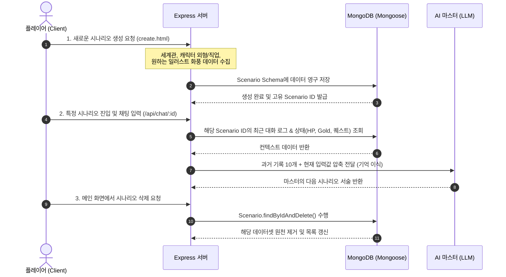

# AI 마스터가 진행해주는 웹 기반 TRPG 

## 실행 - https://trpg-3yyp.onrender.com/

> **"DB 데이터 - 프롬프트 피드백 순환 구조(NER 기법)"** 기반의 웹 기반 TRPG 게임 엔진입니다. 유저의 선택과 AI 마스터의 상호작용을 실시간으로 정밀하게 제어하며, 몰입감 넘치는 텍스트 어드벤처 환경을 제공합니다.

---

## 📜 시나리오 및 세션 관리 시스템 (Scenario & Session Management)

본 프로젝트는 단발성 채팅을 넘어, 플레이어만의 고유한 모험 세계관을 생성하고 영구적으로 보존 및 관리할 수 있는 **멀티 세션 시나리오 파이프라인**을 구축했습니다. 모든 데이터는 유저 고유 ID와 매칭되어 독립된 모험 레이어로 관리됩니다.

### 🗺️ 핵심 관리 프로세스 및 데이터 흐름

### 🛠️ 주요 기능 기술 스펙 (Technical Specification)

1. 고유 세션 기반 시나리오 생성 (create.html & server.js)
세계관 및 캐릭터 맞춤형 빌딩: 단순히 게임을 시작하는 것이 아니라, 시나리오 생성 단계에서 플레이어가 직접 세계관 배경(worldSetting), 캐릭터 정보(characterInfo), 캐릭터 외형(appearance) 및 일러스트 화풍(artStyle: 실사, 애니메이션, 판타지 유화 등)을 커스텀 설정할 수 있습니다.

    Mongoose ODM 스키마 구조: userId 참조 필드를 통해 회원별로 다중 시나리오를 보유할 수 있도록 구조화했으며, 독립된 Object ID 기반 라우팅 경로(window.location.pathname.split('/'))를 통해 고유한 모험 방을 식별합니다.

2. AI 마스터 기억 이식 및 컨텍스트 동기화
상태창 및 가변 데이터 실시간 바인딩: 라우터가 작동할 때 DB에서 현재 시나리오의 실시간 상태값(HP, Gold, 스킬 트리, 병렬 퀘스트 맵)을 긁어모아 시스템 프롬프트에 동적으로 결합합니다.

3. 컨텍스트 유실 방지: 페이지를 새로고침하거나 브라우저를 완전히 나갔다 들어와도 loadHistory()를 통해 DB에 쌓인 과거 메시지 데이터셋({ role: "user/assistant", content: "..." })을 역추적하여 AI의 메모리에 실시간 주입하므로 흐름이 끊기지 않는 영속적인 모험을 보장합니다.

4. 메인 화면 시나리오 관리 및 삭제 메커니즘 (index.html)
유동적 목록 렌더링 (fetchScenarios): 메인 대시보드 진입 시 유저가 보유한 모든 모험 기록 리스트를 REST API를 통해 비동기 호출하고, UI에 동적으로 렌더링합니다.

5. 원격 데이터 소거: 축적된 테스트 데이터나 실패한 모험 기록을 깔끔하게 정리할 수 있도록 각 리스트 카드 옆에 강력한 [삭제] 컴포넌트를 배치했습니다. 클라이언트에서 삭제 요청 시 서버는 엔드포인트(DELETE /api/scenario/:id)를 통해 몽고DB 컬렉션 내의 데이터를 안전하게 원천 소거(Purge)합니다.

## 🗄️ 시나리오 데이터베이스 스키마 구조 (Scenario Schema)

    const ScenarioSchema = new mongoose.Schema({
        userId: { type: mongoose.Schema.Types.ObjectId, ref: 'User' }, // 소유 유저 연동
        title: String,          // 모험의 제목
        worldSetting: String,   // 딥 다크 판타지 등 배경 세계관 사양
        characterInfo: String,  // 캐릭터 이름, 직업 및 기본 스펙
        appearance: String,     // [추가] AI 삽화 생성을 위한 외형 묘사 데이터
        artStyle: String,       // [추가] 생성형 화풍 스타일 (유화/애니/사진 등)
        questLines: [String],   // 5턴 주기로 자동 압축 요약되는 핵심 연대기 로그
        quests: {               // 병렬 진행 가능한 서브/메인 퀘스트 마커 관리 맵
            type: Map,
            of: String          // e.g., {"드래곤 토벌": "진행중", "고블린 처치": "✅완료"}
        },
        bestiary: {             // AI가 실시간 동적 생성한 몬스터 도감 박제 구조
            type: Map,
            of: mongoose.Schema.Types.Mixed // hp, attack, defense, loot 스펙 스택
        },
        createdAt: { type: Date, default: Date.now }
    });

## 🛠 Tech Stack & Technical Decisions (사용 기술 및 채택 이유)

| 분류 | 기술 스택 | 핵심 채택 이유 및 최적화 전략 |
| :--- | :--- | :--- |
| **Front-end** | HTML5, CSS3, JavaScript | 외부 무거운 프레임워크를 배제한 **Vanilla (ES6+) 환경**을 구성하여 경량화된 웹 UI를 구현했습니다. 실시간 캐릭터 상태 UI 변동 및 다크 판타지 컨셉의 3단 패널 레이아웃을 정밀 제어합니다. |
| **Back-end** | Node.js, Express | AI API가 출력하는 대량의 텍스트 스트림을 실시간 가로채고(Intercept) 비동기로 파싱해야 하는 아키텍처 특성상, **이벤트 기반 비동기 처리**에 강력한 Express 환경을 구축했습니다. |
| **Database** | MongoDB | 유저별로 소지 아이템 가방 데이터가 수시로 늘어나고, AI 마스터가 생성하는 난수형 몬스터 스펙(도감)이 비정형으로 변하는 TRPG 게임 데이터 특성에 가장 유연하게 대응하는 **NoSQL 구조**를 채택했습니다. |
| **ORM** | Mongoose ODM | 비정형 데이터 모델 위에 스키마 유효성 검증을 더해 데이터 무결성을 보장합니다. 특히 고질적인 중복 아이템 스택 문제를 해결하고자 **Mongoose Map 구조**를 활용해 안전한 [Key-Value] 동동기화를 실현했습니다. |
| **Authentication** | Google OAuth 2.0 | **Passport.js 및 express-session**을 결합하여 안전하고 표준화된 글로벌 인증 프로토콜을 탑재했습니다. 유저의 고유 구글 ID 값을 인게임 시나리오 세션과 완벽하게 매핑하는 기반이 됩니다. |
| **AI Integration** | LLM API (OpenAI/Gemini) | 하드코딩된 대사 분기 방식의 한계를 깨고 자유도 높은 텍스트 롤플레잉 환경을 만들기 위해 엔진의 핵심 심장부로 탑재했습니다. 비용 폭탄을 막기 위해 **5턴 단위 시나리오 핵심 사건 요약(Snapshot) 주입 메커니즘**을 연동했습니다. |
| **Multimodal** | DALL-E 3 (순천향대) | 유저가 설정한 캐릭터 외형 및 화풍 선택 데이터(실사, 애니, 유화 등)를 이미지 생성 프롬프트 파이프라인에 동적으로 융합하여, 플레이어 맞춤형 상황 삽화를 실시간 자동 렌더링하도록 연동했습니다. |

## 💾 Data Architecture (데이터 구조)

* **인증 및 계정 데이터:** Google OAuth 2.0을 통해 전달받는 유저 식별 정보(`googleId`, `username`, `email`) 기반의 세션 관리
* **실시간 인게임 상태(State):** 플레이어의 실시간 변동 데이터 (`hp`, `gold`, 최대 4개의 `skills`)
* **구조화된 인벤토리 (Mongoose Map Stack):** 자바스크립트 Map 객체를 활용하여 `{"체력 포션": 3, "롱소드": 1}` 형태의 **[아이템명: 수량]** Key-Value 스택 관리
* **실시간 몬스터 도감(Bestiary):** AI가 생성한 적의 스펙(`name`, `hp`, `atk`, `def`, `loot`)을 실시간 DB 영구 동기화
* **대화 및 이미지 로그:** 타임스탬프 기반 컬렉션(`Message`)을 통해 텍스트 로그 및 동적 생성 삽화 URL(Base64) 관리

---

## ⚡ Troubleshooting & Optimization (주요 버그 수정 내역)

### 1. Mongoose Map 객체 데이터 소화 불량 해결
* **문제:** MongoDB가 자바스크립트 내장 Map 데이터를 수동으로 덮어쓸 때 데이터가 유실되는 현상 발생.
* **해결:** `Object.fromEntries(map.entries())` 객체 변환 포장 처리를 통해 DB 저장 및 프론트 전송 안정성 100% 확보.

### 2. "게임을 시작해줘" 오프닝 무한 증식 버그 수정
* **문제:** 새로고침 시 초기 데이터 공백을 인지하고 `start()` 오프닝 서술 함수가 중복 실행되는 현상.
* **해결:** 첫 질문은 DB에 남기지 않고 깔끔하게 오프닝 타이밍만 잡도록 로직 정비.

### 3. AI 컨텍스트 토큰 초과(400 Bad Request) 에러 원천 차단
* **문제:** 생성된 삽화의 거대한 Base64 암호문 덩어리가 AI 대화 히스토리에 그대로 묶여 들어가 토큰 한도를 초과하는 현상 (`PayloadTooLargeError`).
* **해결:** AI에게 컨텍스트를 보낼 때 `startsWith('data:image')` 및 `startsWith('http')`를 걸러내는 데이터 필터링 파이프라인 배치로 에러 원인 제거.

### 4. 비동기 타이밍 및 중복 선언(SyntaxError) 정비
* **문제:** 코드 확장 과정에서 `Scenario has already been declared` 등의 변수 중복 선언 및 자바스크립트 비동기 순서 뒤틀림 발생.
* **해결:** 스코프 정비 및 비동기 흐름(`async/await`) 구조 통합 정리.

---

## 🔮 Future Roadmap (향후 확장 계획)

* **비즈니스 로직 독창성 확보:** 본 프로젝트의 핵심인 **"DB 데이터 - 프롬프트 피드백 순환 구조(NER 기법 기반)"** 아키텍처 특허 출원 검토
* **Spring Boot 마이그레이션:** 대규모 트래픽 대비 및 유지보수성 향상을 위해 거대한 `server.js`를 역할별로 쪼개는 아키텍처 재설계 계획 수립
    * `Controller`: 프론트 접수 및 응답 처리
    * `TRPGMasterService`: Spring AI 프레임워크 기반 LLM 연동 및 흐름 제어
    * `TagParser`: 정규식 및 스트림 API를 활용한 태그 전문 분리 파서 컴포넌트 화
