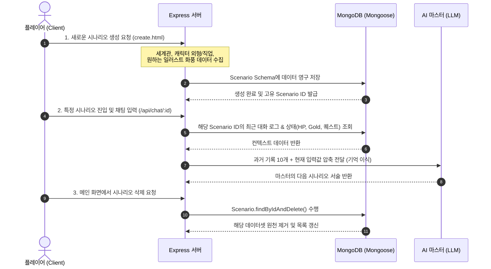

<div align="center">


</div>

#  AI 마스터가 진행해주는 웹 기반 TRPG 
> **"DB 데이터 - 프롬프트 피드백 순환 구조(NER 기법)"** 기반의 웹 기반 TRPG 게임 엔진입니다. 유저의 선택과 AI 마스터의 상호작용을 실시간으로 정밀하게 제어하며, 몰입감 넘치는 텍스트 어드벤처 환경을 제공합니다.


## 웹 페이지로 사용하기 - https://trpg-3yyp.onrender.com/

## 🚀 Getting Started (설치 및 실행 방법)

본 프로젝트를 로컬(Local) 환경에서 다운로드하고 직접 실행하는 방법입니다. 
`.env` 파일과 `node_modules`는 보안 및 용량 최적화를 위해 포함되어 있지 않으므로, 아래 순서에 따라 수동 설정을 진행해 주세요.

### 📋 1. 사전 요구사항 (Prerequisites)
프로젝트를 실행하기 위해 컴퓨터에 아래 프로그램들이 설치되어 있어야 합니다.
* **Node.js**: v18.x 이상 버전 권장 ([다운로드](https://nodejs.org/))
* **MongoDB**: MongoDB Atlas 클라우드 계정 또는 로컬 MongoDB 인프라
* **AI API Credentials**: OpenAI API 키 및 구글 OAuth 사용자 인증 정보

### 🛠️ 2. 설치 및 빌드 (Installation)

1. **저장소 복제 (Repository Clone)**
   깃허브 코드를 본인의 PC로 복사해옵니다.
   ```bash
   git clone [https://github.com/chanchan9741-hash/trpg.git](https://github.com/chanchan9741-hash/trpg.git)
   cd trpg

2. 의존성 라이브러리 패키지 설치
package.json 영수증을 기반으로 프로젝트에 필요한 Express, Mongoose, Passport 등의 패키지를 새로 다운로드합니다.
    ```bash 
    npm install    
3. 환경 변수 설정 (Environment Variables)
    ```bash
    프로젝트 루트 디렉토리(최상위 폴더)에 .env 라는 이름의 파일을 새로 만들고, 본인의 API 키와 DB 주소를 아래 형식에 맞추어 입력해 주세요.

    PORT=3000
    MONGODB_URI=your_mongodb_connection_string
    SCH_AIHUB_API_KEY=your_sch_aihub_api_key
    GOOGLE_CLIENT_ID=your_google_client_id
    GOOGLE_CLIENT_SECRET=your_google_client_secret
    SESSION_SECRET=your_custom_session_secret_key
    ** 구글 클라우드 콘솔의 사용자 인증 정보에서 '승인된 리디렉션 URI'에 http://localhost:3000/auth/google/callback이 반드시 등록되어 있어야 로그인이 정상 작동합니다. **
4. 서버 실행 (Running the Server)
모든 세팅이 끝났다면 터미널에 아래 명령어를 입력해 Express 서버를 구동합니다.
    ```bash
    #개발용 실시간 리로드 실행 (Nodemon 기반)
    npm run dev

    #또는 일반 서버 구동
    npm start


---

## 📜 시나리오 및 세션 관리 시스템 (Scenario & Session Management)

본 프로젝트는 단발성 채팅을 넘어, 플레이어만의 고유한 모험 세계관을 생성하고 영구적으로 보존 및 관리할 수 있는 **멀티 세션 시나리오 파이프라인**을 구축했습니다. 모든 데이터는 유저 고유 ID와 매칭되어 독립된 모험 레이어로 관리됩니다.

### 🗺️ 핵심 관리 프로세스 및 데이터 흐름



## 🛠️ 주요 기능 기술 스펙 (Technical Specification)

<p align="center">
  <a href="./Readme/frontend.md" style="text-decoration:none;">
    
  </a>
</p>

<p align="center">
  <a href="./Readme/backend.md" style="text-decoration:none;">
    
  </a>
</p>


## 🛠️ 기술 스택 스펙트럼 및 채택 이유 (Tech Stack)

| 분류 | 기술 스택 | 핵심 역할 (Core Role) | 기술 채택 이유 (Why Choose This?) | 최적화 및 문제 해결 (Troubleshooting) |
| :--- | :--- | :--- | :--- | :--- |
| **Frontend** | **HTML5 / CSS3** | • 다크 판타지 컨셉의 인게임 3단 패널 레이아웃 구현<br>• 상태창, 인벤토리, 몬스터 도감 모달 오버레이 구조 설계 | • 스크롤을 제한하고 제한된 브라우저 화면 안에서 완벽히 고정된 인게임 UI/UX를 제공하기 위해 Vanilla CSS 레이아웃 제어 기술 채택 | • `Flexbox` 및 `fixed/absolute` 배치를 이용해 해상도 이탈 방지<br>• `flex-direction: column-reverse`를 활용한 채팅 로그 최적화 |
| **Frontend** | **JavaScript<br>(ES6+)** | • `Fetch API` 기반 비동기 서버 통신 제어<br>• 인게임 상태(HP, Gold 등) 변화에 따른 실시간 DOM 데이터 바인딩 | • 데이터 통신 시 브라우저 화면 전체가 깜빡이는 리프레시 현상을 차단하고, 싱글 페이지 애플리케이션(SPA) 급의 연속성 있는 게임 몰입도를 선사하기 위해 채택 | • 전역 상태 객체(`currentInventory` 등) 제어 및 상태 변화 시 DOM 렌더링 함수(`renderStatusContent()`)와의 결합성 확보 |
| **Backend** | **Node.js / Express** | • RESTful 게임 API 엔드포인트 모듈화 라우팅 구현<br>• 보안 필터 및 글로벌 예외 처리 미들웨어 파이프라인 관리 | • V8 엔진 기반의 빠른 비동기 논블로킹(Non-blocking) I/O 처리가 AI 및 DB와의 잦은 API 통신 요청 스택을 효율적으로 수용하기에 가장 적합하여 채택 | • 대용량 데이터 전송 시 서버가 터지는 버그를 예방하기 위해 `express.json({ limit: '50mb' })` 페이로드 용량 제한 조절 기법 적용 |
| **Security** | **Passport.js** | • 구글 OAuth 2.0 프로토콜 연동 기반 중앙 위임 인증 필터 구축<br>• 사용자 고유 식별자 분리 가입 체계 형성 | • 자체 서버에 유저의 비밀번호를 직접 수집·저장하는 모델의 보안 취약점을 완전히 도려내고, 신뢰도 높은 외부 identity 공급자(IdP)를 통해 계정 자산을 보호하기 위해 채택 | • `passport-google-oauth20` 전략 튜닝을 통해 가입 유무 실시간 조회(`findOne`) 및 최초 로그인 시 자동 회원가입(`create`) 흐름 자동화 |
| **Security** | **Express-Session** | • Stateful 기반의 서버 측 실시간 세션 상태 관리<br>• 보안 세션 쿠키 발급 및 복호화 매커니즘 처리 | • 클라이언트 측 데이터 변조 위험이 큰 Stateless 토큰 방식에 비해, 서버 측 메모리(`MemoryStore`)에서 세션 무결성을 직접 통제하여 보안 신뢰도를 극대화하기 위해 채택 | • 브라우저 단의 식별자 가로채기나 위조 요청을 차단하는 암호화 세션 ID(`connect.sid`) 통제 기술 반영으로 세션 하이재킹 방어 |
| **Database** | **MongoDB / Mongoose** | • NoSQL 기반의 가변적 도큐먼트 지향 데이터 영속화<br>• 플레이어 데이터, 대화록, 퀘스트/도감 하이브리드 모델링 | • 실시간 게임 특성상 마스터(AI)가 임의로 생성하는 가변적인 텍스트 컨텍스트 및 복합 맵 데이터를 고정된 테이블 스키마(RDB)보다 훨씬 유연하고 민첩하게 적재하기 위해 채택 | • **Strict DB 인가(Authorization):** 관계형 참조(`ref: 'User'`)를 기반으로 타인의 데이터방 변조 및 수평적 권한 상승(BOLA) 공격을 방어하는 strict 조건절 쿼리 강제 구현 |
| **AI Engine** | **OpenAI API<br>(GPT-4o-mini)** | • 실시간 게임 시뮬레이션을 이끄는 가상 가상 마스터(TRPG GM) 구축<br>• 시스템 프롬프트 조립을 통한 유기적 스토리 분기 제어 | • 인게임의 복잡한 룰북을 이해하고 턴제 전투, 보상 지급, 정교한 마크다운 태그 출력을 가장 균형 잡힌 가성비와 속도로 처리할 수 있는 최고 수준의 추론 성능을 확보하기 위해 채택 | • **실시간 컨텍스트 기억 이식:** 망각 현상을 차단하기 위해 최근 5~10턴 대화 기록을 슬라이싱 주입<br>• 비용 최적화를 위해 폭탄 급 용량의 Base64 삽화 데이터를 걸러내는 이미지 필터 프록시 구축 |
| **AI Engine** | **Regex & Text Parser** | • AI 응답 본문에 포함된 가변 시스템 태그 정밀 가공 추출<br>• 골드, 아이템, 스킬, 몬스터 스탯 파싱 모듈 연동 | • 생성형 AI의 고질적인 불규칙적 줄바꿈 및 형식 이탈 출력 예외 상황 속에서도, 시스템 다운 없이 정수 데이터와 아이템 문자열만 정밀하게 사냥하여 파싱하기 위해 도입 | • 무작위 공백과 노이즈를 완벽 무력화하는 **정규식 캡처 그룹**(`const regex = /(\d+)/;`) 파이프라인 설계로 인게임 크래시 차단 |


## 💾 Data Architecture (데이터 구조)

* **인증 및 계정 데이터:** Google OAuth 2.0을 통해 전달받는 유저 식별 정보(`googleId`, `username`, `email`) 기반의 세션 관리
* **실시간 인게임 상태(State):** 플레이어의 실시간 변동 데이터 (`hp`, `gold`, 최대 4개의 `skills`)
* **구조화된 인벤토리 (Mongoose Map Stack):** 자바스크립트 Map 객체를 활용하여 `{"체력 포션": 3, "롱소드": 1}` 형태의 **[아이템명: 수량]** Key-Value 스택 관리
* **실시간 몬스터 도감(Bestiary):** AI가 생성한 적의 스펙(`name`, `hp`, `atk`, `def`, `loot`)을 실시간 DB 영구 동기화
* **대화 및 이미지 로그:** 타임스탬프 기반 컬렉션(`Message`)을 통해 텍스트 로그 및 동적 생성 삽화 URL(Base64) 관리

---

## ⚡ Troubleshooting & Optimization (주요 버그 수정 내역)

### 1. Mongoose Map 객체 데이터 소화 불량 해결
* **문제:** MongoDB가 자바스크립트 내장 Map 데이터를 수동으로 덮어쓸 때 데이터가 유실되는 현상 발생.
* **해결:** `Object.fromEntries(map.entries())` 객체 변환 포장 처리를 통해 DB 저장 및 프론트 전송 안정성 100% 확보.

### 2. "게임을 시작해줘" 오프닝 무한 증식 버그 수정
* **문제:** 새로고침 시 초기 데이터 공백을 인지하고 `start()` 오프닝 서술 함수가 중복 실행되는 현상.
* **해결:** 첫 질문은 DB에 남기지 않고 깔끔하게 오프닝 타이밍만 잡도록 로직 정비.

### 3. AI 컨텍스트 토큰 초과(400 Bad Request) 에러 원천 차단
* **문제:** 생성된 삽화의 거대한 Base64 암호문 덩어리가 AI 대화 히스토리에 그대로 묶여 들어가 토큰 한도를 초과하는 현상 (`PayloadTooLargeError`).
* **해결:** AI에게 컨텍스트를 보낼 때 `startsWith('data:image')` 및 `startsWith('http')`를 걸러내는 데이터 필터링 파이프라인 배치로 에러 원인 제거.

### 4. 비동기 타이밍 및 중복 선언(SyntaxError) 정비
* **문제:** 코드 확장 과정에서 `Scenario has already been declared` 등의 변수 중복 선언 및 자바스크립트 비동기 순서 뒤틀림 발생.
* **해결:** 스코프 정비 및 비동기 흐름(`async/await`) 구조 통합 정리.

---

## ⚖️ 전체 시스템 아키텍처 트레이드오프 (System-wide Architecture Trade-off)

본 프로젝트는 생성형 AI 기반의 실시간 TRPG 엔진을 안정적으로 구동하고 가변 데이터를 무결하게 영속화하기 위해, 각 레이어(프론트엔드, 백엔드, 데이터베이스, AI 오케스트레이션)별 기술 스택의 장단점을 면밀히 분석하고 의사결정을 수행했습니다.

| 분류 | 채택한 기술 스택 (🟢) | 고려했던 대안 스택 (🔴) | 기술적 선택 이유 (Why Choose This?) | 감수한 한계 및 대응 전략 (Trade-off) |
| :--- | :--- | :--- | :--- | :--- |
| **Frontend<br>UI/UX** | **Vanilla HTML5 / CSS3<br>& JavaScript (ES6+)** | **React / Vue.js<br>(Modern Framework)** | • 인게임 3단 고정 패널 레이아웃 및 윙 상태창 구축 시 불필요한 프레임워크 오버헤드 최소화<br>• 가벼운 가상 레이어 모달(Modal)과 비동기 `Fetch API` 조합으로 SPA 급의 반응성 확보 | • 컴포넌트 재사용성이 낮아질 위험이 있으나, UI 렌더링 모듈(`renderStatusContent()`)과 비동기 전처리 로직을 독자적 함수로 구조화하여 스크립트 오염 최소화 |
| **Backend<br>Runtime** | **Node.js / Express** | **Java / Spring Boot** | • OpenAI/Gemini 공식 SDK 및 인프라와의 높은 연동 편의성<br>• 싱글 스레드 비동기 이벤트 루프 기반의 논블로킹 I/O 가 잦은 AI API 통신을 경량화하여 수용하기에 최적화 | • 서비스 비대화 시 계층 분리 누락으로 인한 코드 파편화 리스크 인지. 이를 방어하기 위해 라우터 모듈화 및 이미지 프록시 필터 단을 서버 상단에 전면 배치 |
| **Database<br>Storage** | **MongoDB / Mongoose** | **MySQL / PostgreSQL<br>(Relational DB)** | • AI 가상 마스터가 실시간으로 가변 생성하는 비정형 문맥(대화 로그, 복합 구조 퀘스트 맵, 몬스터 스탯)을 고정 테이블(RDB)보다 기민하게 적재 가능 | • 관계형 조인(Join)의 부재는 Mongoose의 고유 `ref: 'User'` ObjectId 참조 설정을 통해 엄격한 수평적 권한 인가(`findOne({ _id, userId })`)를 구현해 극복 |
| **Security<br>Auth** | **Passport.js &<br>Express-Session** | **JWT (JSON Web Token)<br>Stateless 토큰 인증** | • 클라이언트 측 스크립트 가로채기(XSS) 위협이 큰 JWT보다, 서버 측 메모리(`MemoryStore`)에서 세션 상태 무결성을 완전히 통제하여 보안 신뢰성 확보 | • 단일 프로세스 RAM 세션 관리로 인한 스케일 아웃 제한 경고 확인. 향후 서비스 확장 시 분산 인메모리 DB인 **Redis를 분산 세션 저장소로 이식**하는 확장 로드맵 수립 |

| **DevOps<br>Workflow** | **GitHub Git Flow<br>(Squash Commit)** | **전체 커밋 이력<br>단순 푸시 (Push)** | • 노트북과 데스크톱 기기를 오가는 교차 원격 개발 환경 속에서 소스코드 휘발 리스크 헤징<br>• 이력서/포트폴리오 제출 시 커밋 히스토리의 세련된 가독성 확보 | • 로컬 머신과 원격 레포지토리 간의 역사가 꼬여 강제 푸시(`--force`)를 수반하는 정합성 예외 통제를 감수하고, 최종 저장소의 영혼까지 **단일 명품 커밋 라인으로 최적화 클렌징** 완수 

---


