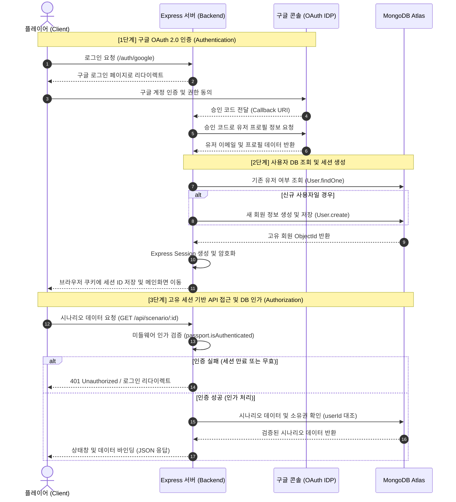
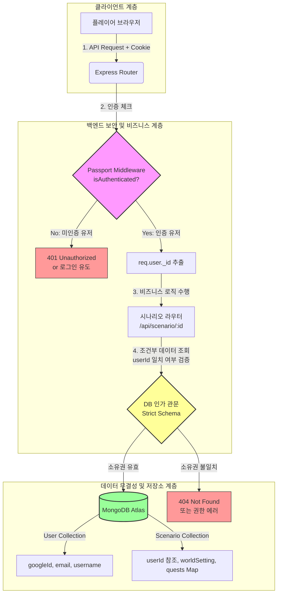

  

## 🛡️ 백엔드 API & DB 인증/인가 시스템 (Authentication & Authorization)
본 프로젝트는 안전한 사용자 데이터 관리와 시나리오 보호를 위해 구글 OAuth 2.0 기반의 인증과 Express-Session 메커니즘을 결합한 다중 보안 인가 체계를 구축했습니다. 타인의 시나리오 데이터나 모험 기록(데이터 무결성)을 완벽히 격리·보호하는 것을 핵심 목표로 합니다.

### 컴포넌트 간 데이터 보호 및 인가 구조 (Architecture Diagram)
클라이언트의 요청이 어떤 보안 관문(인증 미들웨어, DB 소유권 검증)을 거쳐 데이터베이스에 도달하는지 보여주는 구조도입니다.

1. 고유 세션 기반 시나리오 생성 (create.html & server.js)
세계관 및 캐릭터 맞춤형 빌딩: 단순히 게임을 시작하는 것이 아니라, 시나리오 생성 단계에서 플레이어가 직접 세계관 배경(worldSetting), 캐릭터 정보(characterInfo), 캐릭터 외형(appearance) 및 일러스트 화풍(artStyle: 실사, 애니메이션, 판타지 유화 등)을 커스텀 설정할 수 있습니다.

    Mongoose ODM 스키마 구조: userId 참조 필드를 통해 회원별로 다중 시나리오를 보유할 수 있도록 구조화했으며, 독립된 Object ID 기반 라우팅 경로(window.location.pathname.split('/'))를 통해 고유한 모험 방을 식별합니다.

2. AI 마스터 기억 이식 및 컨텍스트 동기화
상태창 및 가변 데이터 실시간 바인딩: 라우터가 작동할 때 DB에서 현재 시나리오의 실시간 상태값(HP, Gold, 스킬 트리, 병렬 퀘스트 맵)을 긁어모아 시스템 프롬프트에 동적으로 결합합니다.

3. 컨텍스트 유실 방지: 페이지를 새로고침하거나 브라우저를 완전히 나갔다 들어와도 loadHistory()를 통해 DB에 쌓인 과거 메시지 데이터셋({ role: "user/assistant", content: "..." })을 역추적하여 AI의 메모리에 실시간 주입하므로 흐름이 끊기지 않는 영속적인 모험을 보장합니다.

4. 메인 화면 시나리오 관리 및 삭제 메커니즘 (index.html)
유동적 목록 렌더링 (fetchScenarios): 메인 대시보드 진입 시 유저가 보유한 모든 모험 기록 리스트를 REST API를 통해 비동기 호출하고, UI에 동적으로 렌더링합니다.

5. 원격 데이터 소거: 축적된 테스트 데이터나 실패한 모험 기록을 깔끔하게 정리할 수 있도록 각 리스트 카드 옆에 강력한 [삭제] 컴포넌트를 배치했습니다. 클라이언트에서 삭제 요청 시 서버는 엔드포인트(DELETE /api/scenario/:id)를 통해 몽고DB 컬렉션 내의 데이터를 안전하게 원천 소거(Purge)합니다.

## 🗄️ 시나리오 데이터베이스 스키마 구조 (Scenario Schema)

    const ScenarioSchema = new mongoose.Schema({
        userId: { type: mongoose.Schema.Types.ObjectId, ref: 'User' }, // 소유 유저 연동
        title: String,          // 모험의 제목
        worldSetting: String,   // 딥 다크 판타지 등 배경 세계관 사양
        characterInfo: String,  // 캐릭터 이름, 직업 및 기본 스펙
        appearance: String,     // [추가] AI 삽화 생성을 위한 외형 묘사 데이터
        artStyle: String,       // [추가] 생성형 화풍 스타일 (유화/애니/사진 등)
        questLines: [String],   // 5턴 주기로 자동 압축 요약되는 핵심 연대기 로그
        quests: {               // 병렬 진행 가능한 서브/메인 퀘스트 마커 관리 맵
            type: Map,
            of: String          // e.g., {"드래곤 토벌": "진행중", "고블린 처치": "✅완료"}
        },
        bestiary: {             // AI가 실시간 동적 생성한 몬스터 도감 박제 구조
            type: Map,
            of: mongoose.Schema.Types.Mixed // hp, attack, defense, loot 스펙 스택
        },
        createdAt: { type: Date, default: Date.now }
    });