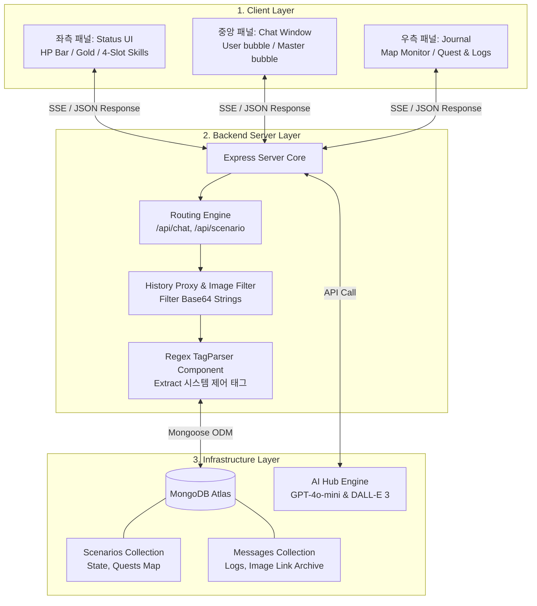
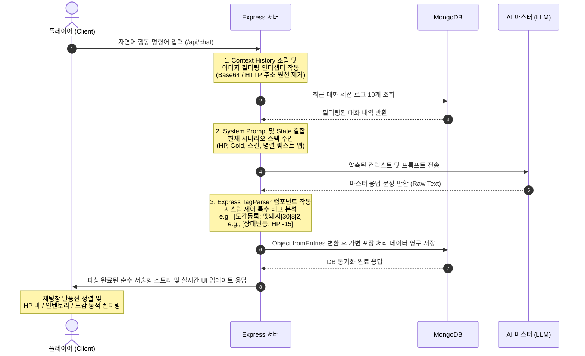

  


# 데이터 흐름 구조
## 💾 Data Architecture (데이터 구조)

* **인증 및 계정 데이터:** Google OAuth 2.0을 통해 전달받는 유저 식별 정보(`googleId`, `username`, `email`) 기반의 세션 관리
* **실시간 인게임 상태(State):** 플레이어의 실시간 변동 데이터 (`hp`, `gold`, 최대 4개의 `skills`)
* **구조화된 인벤토리 (Mongoose Map Stack):** 자바스크립트 Map 객체를 활용하여 `{"체력 포션": 3, "롱소드": 1}` 형태의 **[아이템명: 수량]** Key-Value 스택 관리
* **실시간 몬스터 도감(Bestiary):** AI가 생성한 적의 스펙(`name`, `hp`, `atk`, `def`, `loot`)을 실시간 DB 동기화
* **대화 및 이미지 로그:** 타임스탬프 기반 컬렉션(`Message`)을 통해 텍스트 로그 및 동적 생성 삽화 URL(Base64) 관리


## 1. 🔄 실시간 대화 및 데이터 순환 흐름 (Core Sequence)

유저가 말풍선 채팅창에 자연어 명령어(행동)를 입력했을 때, Express 서버가 데이터 무결성을 확보하고 AI 마스터의 컨텍스트를 가공하여 MongoDB와 최종 동기화하는 정밀 시퀀스 흐름입니다.



## 2.🧱 시스템 데이터 레이어 구조 (Data Architecture)
엔진이 처리하는 데이터의 성격과 특징에 따라 비정형 문서(Document), 정형 세션(Session), 가변 구조(Map)를 유기적으로 배치한 인프라 구조도입니다.



## 🛡️ 3. 예외 처리 및 최적화 제어 흐름 (Troubleshooting Flow)
1.  400 Bad Request (Payload Too Large) 예외 차단
DALL-E 3 가 가동되어 생성된 거대한 이미지 데이터가 대화 히스토리 버퍼에 누적되어 토큰 한도를 폭파시키는 에러(PayloadTooLargeError)를 방어하는 프록시 단의 전처리 알고리즘입니다.
    ```mermaid
    graph TD
    A[Express /api/chat 요청 수신] --> B(DB Message History Array 순회 루프 시작)
    B --> C{텍스트 원문 검사<br>string.startsWith}
    C -->|data:image| D[배열 적재 Skip<br>Context 경량화]
    C -->|http| D
    C -->|일반 서술형 텍스트| E[Buffer에 Safe Push]
    D --> F[루프 지속]
    E --> F
    F --> G[압축된 버퍼만 AI 백본으로 전송]
    ```

2. Mongoose Map 하이브리드 동기화 (데이터 유실 방지)
MongoDB 스키마 내부에서 자바스크립트 내장 Map 형태로 관리되는 인벤토리 및 도감 객체를 덮어쓸 때, 변경 사항이 무시되거나 증발하는 현상을 해결하기 위해 설계된 데이터 포장 가변 파이프라인입니다.

    ```mermaid
    graph LR
    A[AI 마스터가 생성한<br>몬스터 도감 데이터 수신] --> B[Scenario 스키마 내<br>bestiary 인스턴스 확보]
    B --> C[Mongoose 고질적 버그 대응<br>Object.fromEntries 변환 적용]
    C --> D[(깔끔한 JSON 오브젝트 형식으로<br>MongoDB 영구 저장 및 리턴)]
    ```

