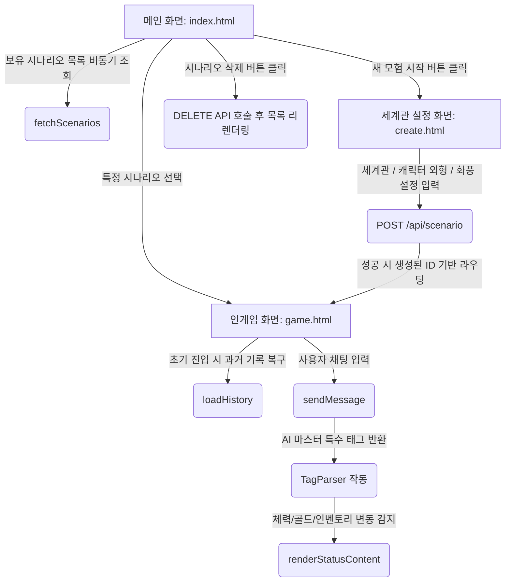
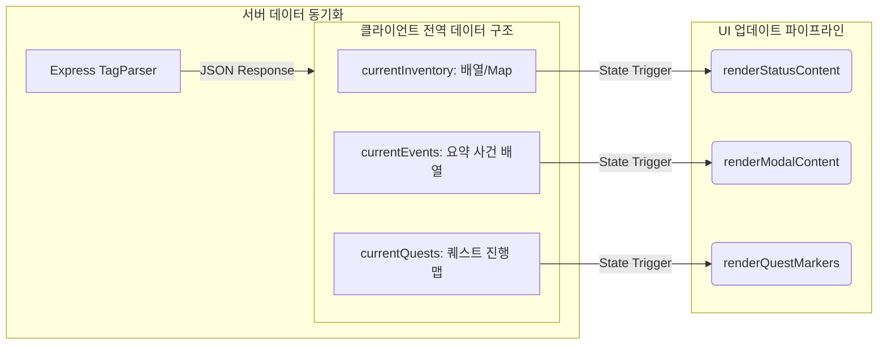

 
  
## 💻 프론트엔드 아키텍처 (Frontend Architecture)

본 프로젝트의 클라이언트 단은 플레이어의 높은 몰입감을 위해 **다크 판타지 TRPG UI 테마**를 일관되게 유지하며, 비비동기(Async/Await) 통신을 기반으로 한 동적 UI 렌더링 및 실시간 상태 동기화 구조로 설계되었습니다.

### 🔄 1. 화면 전환 및 데이터 흐름 (Screen Flow)

사용자의 진입부터 게임 플레이, 세션 관리까지의 프론트엔드 내비게이션 및 API 연동 흐름은 다음과 같습니다.

### 컴포넌트 및 UI 구조 (UI Components)
화면 가독성을 극대화하고 CRPG 특유의 인터페이스를 구현하기 위해 화면 레이아웃을 3가지 핵심 핵심 구역과 모달 컴포넌트로 분리하여 고정(position: absolute/fixed) 배치했습니다.

### 메인 대시보드 (index.html)

시나리오 카드 덱: 유저가 생성한 모험들의 정보(세계관, 타이틀)를 REST API로 긁어와 동적으로 카드 UI 형태로 렌더링합니다.

제어 액션 컴포넌트: 각 시나리오 카드 내부에 인게임 진입 버튼과, 세션 데이터 원격 소거를 위한 [삭제] 버튼을 유기적으로 배치했습니다.

### 인게임 화면 (game.html)

메인 뷰 포트: AI 마스터가 서술하는 다크 판타지 배경 및 DALL-E 기반 삽화 이미지가 출력되는 중앙 스크린 영역입니다.

사이드 윙 상태창 (#status-window): 화면 좌측 레이어에 반투명 양피지 테마로 고정되어, 실시간 데이터(HP 바, Gold 등)를 직관적으로 상시 노출합니다.

하단 액션 대화창 (#chat-section): 플레이어의 행동 입력 양식(Input)과 AI 메시지 말풍선이 flex-direction: column 구조로 차곡차곡 스택되는 영속적 로그 컴포넌트입니다.

모달 시스템 (#inventory-list-modal 등): 화면을 무겁게 차지하던 지저분한 사이드바를 제거하고, 확장형 인벤토리 및 AI가 동적으로 갱신한 몬스터 도감(bestiary)을 팝업 형태로 호출하여 깔끔한 화면 해상도를 확보했습니다.

### 💾 3. 클라이언트 상태 관리 (Client State Management)
데이터 분류와 저장을 통한 ai 영속성 유지

데이터 영속성 및 동적 렌더링 다이어그램

### 핵심 상태 데이터 사양
가변 데이터 전역 관리: currentInventory, currentEvents, currentQuests 변수를 전역 공간에 확보하여 AI 마스터와의 인터랙션 결과셋을 실시간 저장하는 1차 버퍼 역할을 수행합니다.

새로고침 컨텍스트 유지: 브라우저 종료 및 새로고침(F5) 시 데이터가 휘발되는 문제를 차단하기 위해, 초기 구동 시 URL 경로에서 식별자 ID(window.location.pathname.split('/'))를 파싱하여 백엔드로부터 상태값과 과거 대화 데이터셋({ role, content })을 역추적해 다시 빌딩하는 영속성 파이프라인을 구축했습니다.

데이터 바인딩 및 동기화 (renderStatusContent): 비동기 fetch 요청 완료 시 단순히 데이터만 변경하는 것이 아니라, UI 변경 이벤트 핸들러가 가동되어 체력 게이지 바(width %), 골드 지표텍스트, 퀘스트 수량이 동기화되어 화면에 즉각 리렌더링되도록 구현했습니다.
